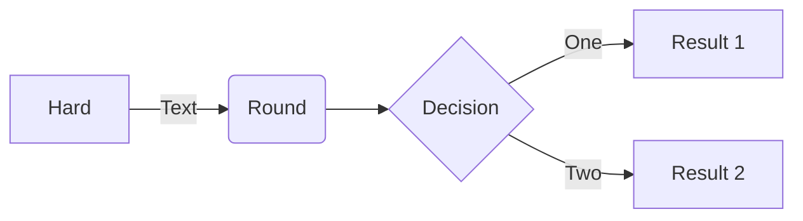

## fr

```scala
object HelloWorld {
  def main(args: Array[String]): Unit = {
    println("Hello, world!")
  }
}
```


```mermaid
flowchart LR

A[Hard] -->|Text| B(Round)
B --> C{Decision}
C -->|One| D[Result 1]
C -->|Two| E[Result 2]

```
